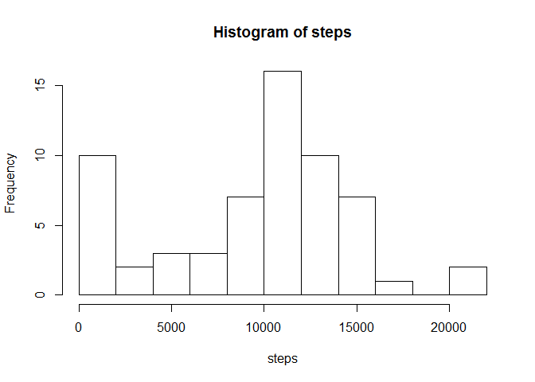
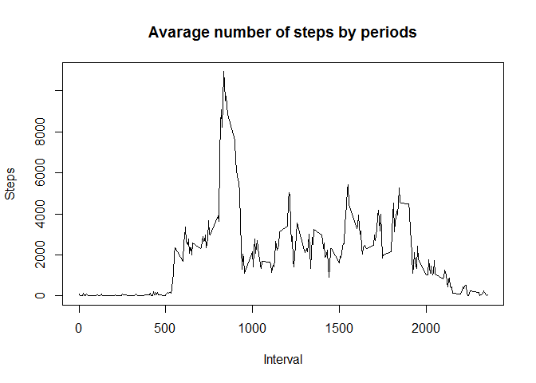
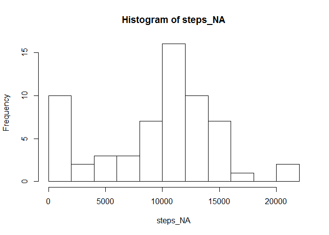
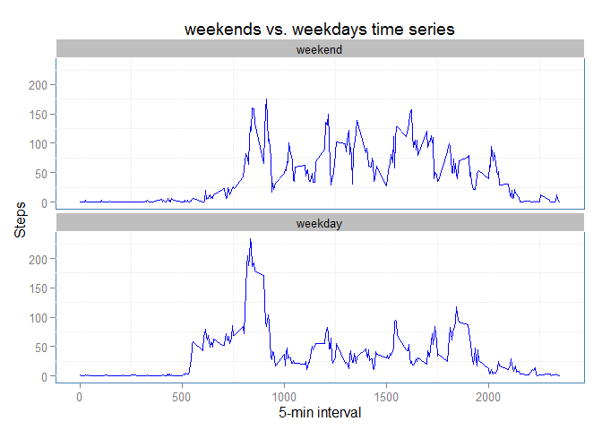

# Reproducible Research: Peer Assessment 1

```
## [1] "English_United States.1252"
```

```
## 
## Attaching package: 'dplyr'
## 
## The following object is masked from 'package:stats':
## 
##     filter
## 
## The following objects are masked from 'package:base':
## 
##     intersect, setdiff, setequal, union
```
##Reading data


```r
RepData <- read.csv("activity.csv")
```

##What is mean total number of steps taken per day? 

###Processing Data

```r
steps <- tapply(RepData$steps, RepData$date, sum, na.rm = TRUE)
```

###Create Histogram

```r
hist(steps, breaks = 10)
```

 

###Calculate Mean and Median

```r
steps_median <- median(steps)
steps_mean <- mean(steps)
```
Number of steps taken each day Median is 10395, and  Mean is 9354.2295082.

##What is the average daily activity pattern?
###Processing Data

```r
steps_by_interval<-as.data.frame(tapply(RepData$steps,  RepData$interval, sum, na.rm = TRUE))
steps_by_interval$intreval <- row.names(steps_by_interval)
names(steps_by_interval) <- c("steps","intreval")
```

###Create Plot

```r
with(steps_by_interval, plot(intreval, steps, main = "Avarage number of steps by periods", 
             type="l", xlab="Interval", ylab="Steps"))
```

 

###Find period with maximum of steps


```r
max_period <- steps_by_interval$intreval[which.max(steps_by_interval$steps)]
max_steps <- max(steps_by_interval$steps)
```
The Period with maximum of steps is 835 and maximum value of steps is 10927

##Imputing missing values

###Calculating and reporting the total number of missing values in the dataset

```r
sum(is.na(RepData$steps))
```

```
## [1] 2304
```

###Strategy for filling in all of the missing values in the dataset
NA will be repaced by mean of current interval across all days

###Creating new dataset with replaced NA

```r
steps_mean_by_interval<-as.data.frame(tapply(RepData$steps,  RepData$interval, mean, na.rm = TRUE))
steps_mean_by_interval$intreval <-as.integer(row.names(steps_mean_by_interval))
names(steps_mean_by_interval) <- c("steps","intreval")
NO_NA_RepData <- RepData
for (i in 1:nrow(RepData) ) {
  if (is.na(NO_NA_RepData[i, 1])) {
    NO_NA_RepData[i, 1] <- as.integer(steps_mean_by_interval$steps[which(steps_mean_by_interval$intreval == 15)])
   }
}
```
###Create Histogram

```r
steps_NA <- tapply( NO_NA_RepData$steps,  NO_NA_RepData$date, sum, na.rm = TRUE)
hist(steps_NA , breaks = 10)
```

 
Hist of the first part of Assigment looks a very similar as Hist of third part, so in my opinion NA has not strong influence on result of research.

##Differences in activity patterns between weekdays and weekends

###Creating a new factor variable in the dataset with two levels - "weekday" and "weekend"

```r
RepData$date<- as.Date(RepData$date)
weekdays_days <- c('Monday', 'Tuesday', 'Wednesday', 'Thursday', 'Friday')
RepData$wDay <- factor((weekdays(RepData$date) %in% weekdays_days), levels=c(FALSE, TRUE), labels=c('weekend', 'weekday'))
```

###Preparing data for plots

```r
mydata_byinterval <-group_by(RepData, wDay, interval) 
DataTimeSeries<-summarize(mydata_byinterval, steps=mean(steps, na.rm = TRUE)) 
```

###Create Plot

```r
ggplot(DataTimeSeries, aes(x=interval, y=steps))+geom_line() + labs(x="5-min interval", y="Steps" )   +facet_wrap(~wDay, ncol=1)+ geom_line(colour = "blue", size =0.6) + labs(title="weekends vs. weekdays time series") + theme(panel.background = element_rect(fill = 'white', colour = 'steelblue')) + theme(strip.background=element_rect(fill='grey', colour='white'))
```

 
